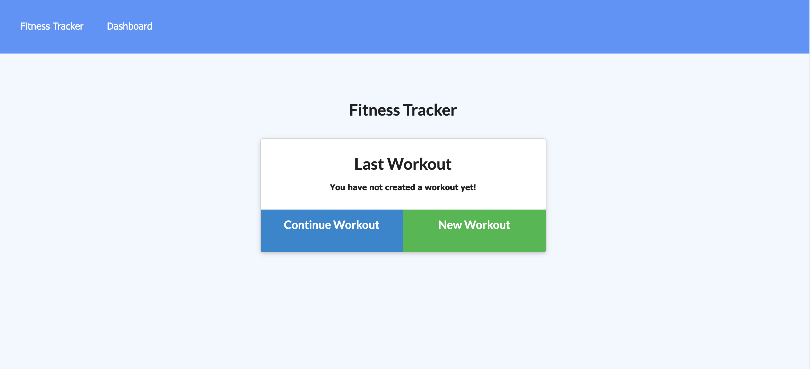
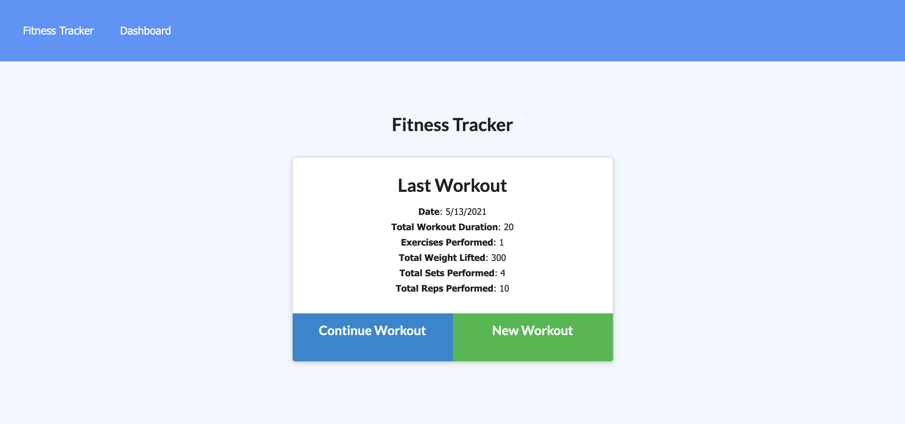
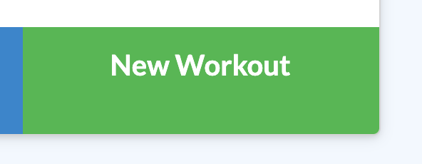
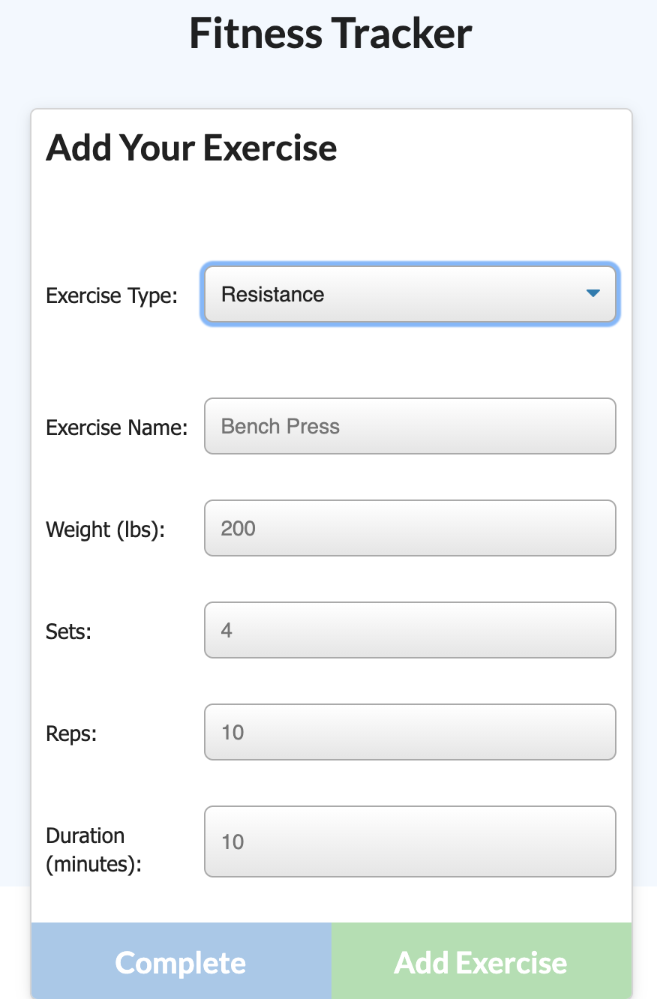
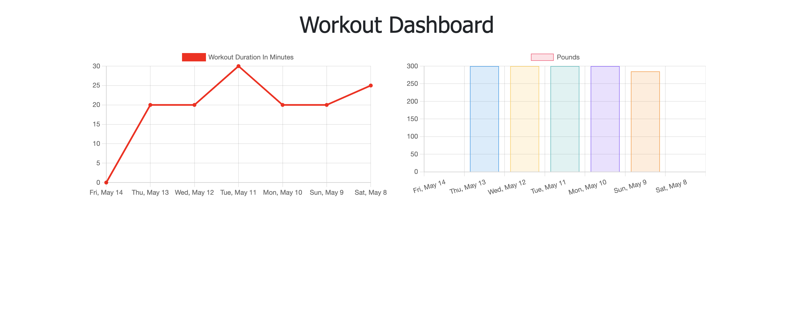

# Workout Tracker

This week's assignment had us creating a workout tracker. Our jobs was to build a website that connects to a mongo backend and a JavaScript front end. 

## 1. Homepage 

When you access the page, you will see your last workout. If you access this page and you haven't worked out before, it will be empty.

If you have worked out before, it will display the info of your last workout. 

## 2. Create Workout

If you want to start a new workout, click the New Workout button. 

## 3. Add Exercise

You can add an exercise by clicking the "Continue Workout" button.

## 4. Data Visualization 

If you would like to view your progress overtime you can view the dashboard. This will contain data visualization for what you have accomplished. 

[Website](https://progressive-web.herokuapp.com/)